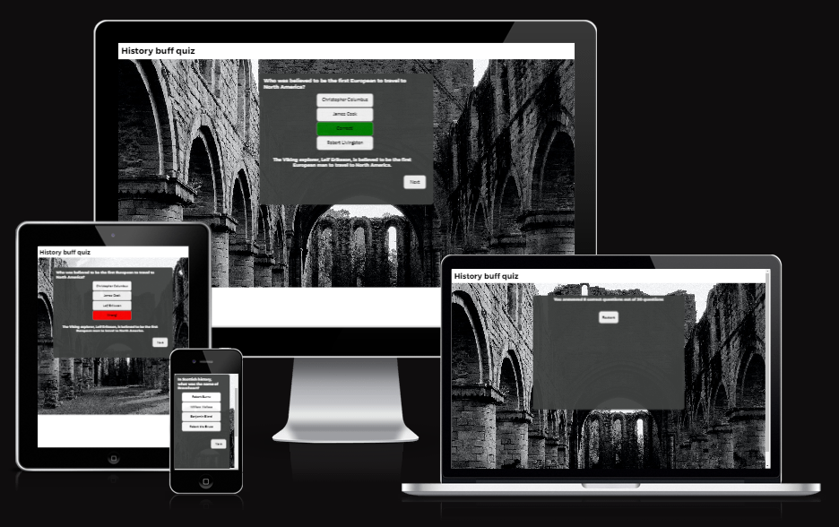
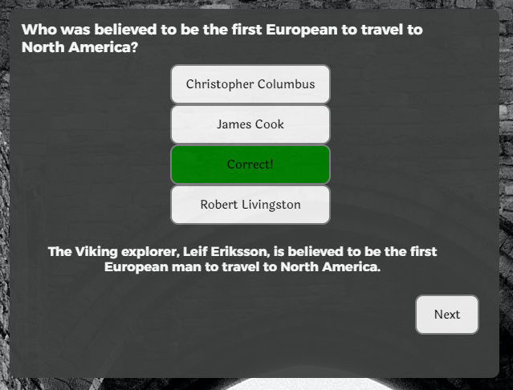
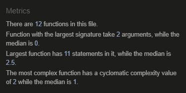
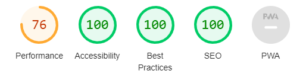

# History buff quiz #

The history buff quiz is a light-hearted quiz testing the users knowledge of some well-known and perhaps some not so well known facts on history. It is intended for entertainment and educational purposes. The quiz covers many topics in history such as the Russian Soviet era, Henry VIII's reign, the Roman empire and American political history.  

This project was built for the purpose of the project 2 submission for the Code Institute full stack software development diploma. This project is still under development.

The site can be found [here](https://bgcg.github.io/project2/).

## UX ##

### Audience ###

For users who want to test their History knowledge and learn more about historical facts. 

### User goals ###

* **Current user goals:** To remember these historical facts by repetitions through the games.

* **New user goals:** To test their knowledge on history and have some fun with it.

### Accessibility ###

Dark text is overlayed on a white background or light text overlayed on dark background to enhance readability of the text. The image used for the background image for decorative purposes only.

### Responsive design ###

This game was built with responsive design in mind using media queries to make it compatible for screen sizes of various smartphones, tablets, laptop and desktop.

## Design ##

### Imagery ###

The quiz has a background of ruins of a castle to represent the subject of the quiz.

### Color Scheme ###

 Dark tones (grey and black) used to represent the perhaps lack of colors of items in the past. 

### Typography ###

Laila font was used for the answer, next, start and restart buttons as it has a appearance reminiscent of old scripts of historical texts. 
I used Alexandria font as the header and question elements as this gives a slight contrast with Laila, emphasising this is a light-hearted quiz, although perhaps about serious subjects in history. 

## Features ## 

**Start button:**

The start button is clickable and takes you to the first question.

**Question display:** 

The question is displayed with four options, when the button is clicked it will alert the user whether their response was wrong/invalid. A description below the option buttons will display the right answer with a small explanation when an option is clicked. 

**Clickable interactivity:** 

When the option buttons are clicked they will turn green and change text to 'Correct!' when the question is answered correctly or the button will turn red and display the text 'Wrong!' when the answer is incorrect. Once the user has selected one option, all the buttons become disabled so the user can't break the game. 

**Next:**

The next button when clicked will display a new question with four options and the color of the buttons will be refreshed to white. If the user tries to click the next button without selecting an option then an alert will pop up informing them to select a question before moving on. 

**Refresh:**

After 20 questions, a page will come up with a restart button so the user can restart the game if they wish - which will take them back to the start page. Additionally, the user will be told the number of questions they answered correctly out of the total question number. 

## Testing ##
 
### Troubleshooting and optimisation ###

The main areas that required the most troubleshooting and optimisation in this project was constructing the loops to iterate through each question. I included `console.log` in the showNextQuestion() function which reported how many loops had been executed, where I found that when moving to the next question, there were three loops. I struggled to determine the root cause of this issue, thinking it could be due to iterations through the options which could be increasing the amount of loops when moving to a next question. I gained some clarification when I contacted tutor support who advised me that I had an event listener for the next button present inside the `resetButton()` function that was causing this excessive looping who advised me to move the event listener outside the function which resolved this issue.

Additionally, I had an issue with the disabling the buttons so that the user couldn't just click multiple times on the buttons to either increase the score or select another button to find the right answer. I consulted some MDN and W3 schools documentation as described in the credits section of this README about the `:disable` pseudo-class and how to implement this in the JS script. However, I found when I wrote `optionsBtn.disabled = true` it was only working for the button that was clicked on. I was trying to solve this for a few hours and only coming to the rather simple conclusion that I need to specify the index of the button I would like to disable - which was all of them. 

When diabling buttons after a click event, I had some difficulties determining how to disable all the buttons. I found I had to specify the index of the buttons to disable as I couldn't figure out a way to disable all the buttons at once with the click event of one button. Therefore I specified all the indexes of the buttons in seperate lines of code. Although somewhat repetitive, it did the trick. In relation to disabling the buttons, I wanted to create an alert if the user tried to press the next button. To my knowledge, it's not possible to put a 'click' in a conditional if statement, so instead I used the button disabled condition as this event happens directly after the click event. I just used `optionsBtn[0].disable` as the condtional - as I only needed to target one of the buttons being disabled as the code above would disable all the buttons anyway. 

### Key testing points ###

* Passed through HTML validator and no errors were found

* Passed through CSS validator and no errors were found

* Tested on Javascript JShint quality control tool with no errors found 

* Generated a lighthouse report using Dev Tools which yielded an excellent accessibility score

* Google Developer tools to test responsiveness of site and for fixing bugs in JS script
* I confirm that the feedback alerted to the user is correct (i.e. question correct answers are accurate to the best of my knowledge)
* I confirmed that this quiz looks good across multiple devices which I tested using Chrome Developer tools 

## Debugging ##

My quiz background image wasn't appearing initially - I found removal of the initial '/' in the path in the `url()` in the background image selector in the css code solved this issue. Further troubleshooting of bugs will be discussed in the 'troubleshooting and optimisation' section in the testing section. 

## Deployment ##

This site is hosted on GitHub pages by adhering to the following steps; 

* Go to settings in project repository
* Click on pages 
* Set branch to 'main' 

The site can be found [here](https://bgcg.github.io/project2/).

## Technologies used ##
 
* HTML
* CSS 
* Javascript

### Libraries and frameworks ###

* Google fonts for fonts Laila and Alexandria 
* Am I responsive for the screenshots in the introduction to this README
* Jshint Javascript validator 
* Jigsaw CSS validator 
* W3C HTML validator
* The web hosting service GitHub was used to deploy this site
* GitPod a developer platform to write and edit the code which was eventually pushed to Github 
* Visual studio code for project planning - in particular for the JS code as I required some space to practice before I implemented the final project in GitPod

## Credits ##

### Content ###

When starting this project, I sought some inspiration on how to approach how to build an online quiz. I found the youtube video from [Web Dev Simplified](https://www.youtube.com/watch?v=riDzcEQbX6k&t=1172s) very informative on how to approach building an online quiz, however I took a different approach in a multiple areas. The following points were the main learnings from this tutorial; 
* Reminder of the Code Institute teachings on how to grab elements from the DOM 
* Assignment of the question index to 0 and then iterating from there with index++ 
* Hiding and unhiding elements using `element.classList.add('hide')` and adding a `.hide {display: none;}` in CSS

Note: although I used the above tutorial as a guideline how to approach scripting a quiz, I customised my code throughout such as I took a different approach to dispalying the options than Web Dev Simplified.

My main areas of troubleshooting were the iteration through the options to make the correct options appear in the button elements. I found the [stack overflow](https://stackoverflow.com/questions/23177484/how-to-loop-through-questions) post really helpful and the following youtube video by [Zenva](https://www.youtube.com/watch?v=RswgVWKJRLM) iterate through options; which advised using the `.forEach` method of iterating through each element. 

To select all my option buttons, I made use of the querySelectorAll selector; I found the [folkstalk](https://www.folkstalk.com/2022/09/event-listener-to-elements-with-class-with-code-examples.html) post helpful in learning how to use this selector.  

When the user moved to the next question, I wanted the button to refresh its color back to white (as if you user clicked on the button it would either be red or green and stay that way through the game unless I refreshed it). I found the following post helpful on [bobbyhadz](https://bobbyhadz.com/blog/javascript-change-button-color-onclick) helpful in me achieving this.

When the quiz ended I wanted the page to refresh when the user pressed the 'Restart' button. I found the following [stack overflow](https://stackoverflow.com/questions/29884654/button-that-refreshes-the-page-on-click) post helpful. 

Intially, the user could select multiple answers so therefore with feedback from my tutor who suggested this would be best to change this, I implemented a disable CSS pseudo-class, in which I found the [MDN documentation](https://developer.mozilla.org/en-US/docs/Web/CSS/:disabled) helpful in describing how this works. Additionally, I found the [W3 Schools](https://www.w3schools.com/jsref/prop_pushbutton_disabled.asp) page useful in infroming me how this would be used in the JS script to disable the buttons. 

For the CSS styling, I was having issues with centering my question container on the page - I found the reply from avdgaag in this [stack overflow](https://stackoverflow.com/questions/953918/how-to-align-a-div-to-the-middle-horizontally-width-of-the-page) post helpful in achieving this who suggests to `text-align: center;` your body element to ease positioning of other elements on the page. 

### Images ### 

The background image was provided by [pexels.com](https://www.pexels.com/photo/grayscale-photo-of-brick-building-9480102/) taken by the contributor Lisa Fotios.

### People ###

For my mentor for her feedback and tutor support at Code Institute for pointers on how to solve specific issues with the code. My fiance Benjamin Bland, who studied History at University, for input into good questions to use in the quiz and to check to ensure they were accurate. 

## Historical facts references ##

* I had to double checked the [pencillin wikipedia article](https://en.wikipedia.org/wiki/Penicillin) as I forgot which species of fungus pencillin was derived from. I also wanted to check different scientists who worked on Pencillin so I could provide some good alternative answers to the user.  
* The [Origin of Species Wikipedia](https://en.wikipedia.org/wiki/On_the_Origin_of_Species) article as I forgot the year which the book was published. 
* I forgot the age of the pyramids so I check the [National Geographic](https://www.nationalgeographic.com/history/article/giza-pyramids#:~:text=The%20Giza%20Pyramids%2C%20built%20to,constructed%20some%204%2C500%20years%20ago) article.
* I needed to double check the capacity of the Circus maximus so I double checked the [rome.net](https://www.rome.net/circus-maximus#:~:text=The%20Circus%20Maximus%20in%20Rome,with%20space%20for%20300%2C000%20spectators) website for this.
* I forgot the name of the first man in space so I checked the following [Wikipedia](https://en.wikipedia.org/wiki/Yuri_Gagarin) article. 
* To double checked the name of the Viking explorer who is believed to be the first european to travel to North Ameria I checked the following [article]( https://www.npr.org/2007/10/08/15040888/coming-to-america-who-was-first#:~:text=We%20know%20now%20that%20Columbus,America%20and%20established%20a%20settlement.).

